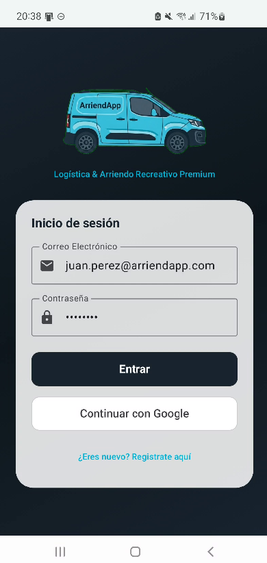
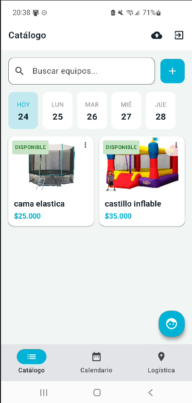
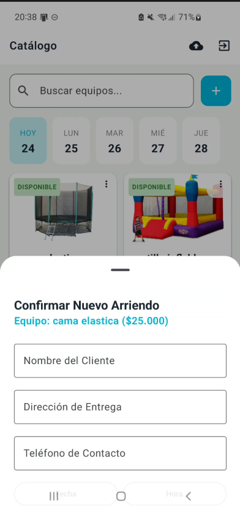
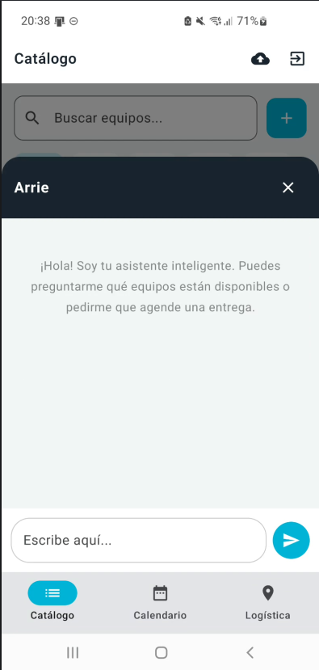
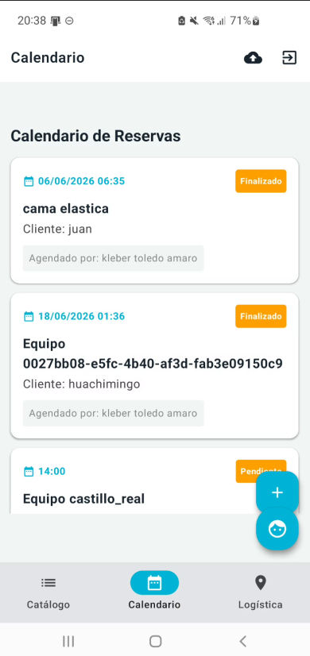
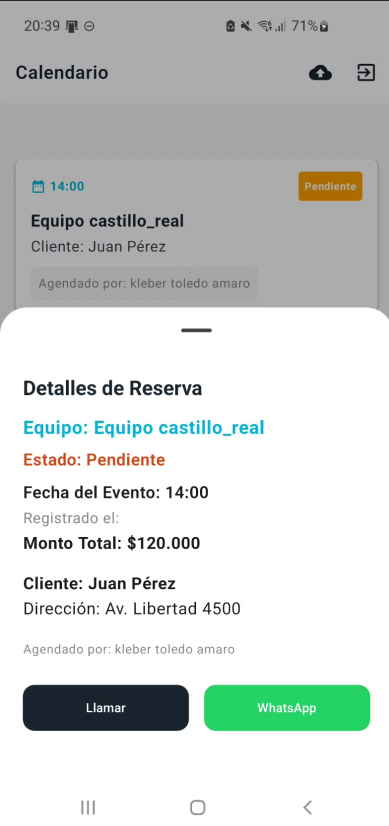
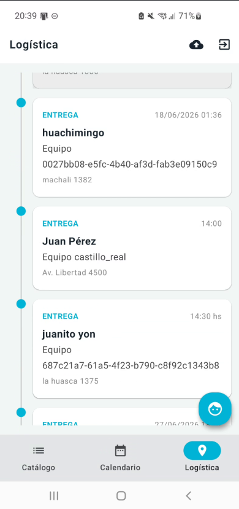
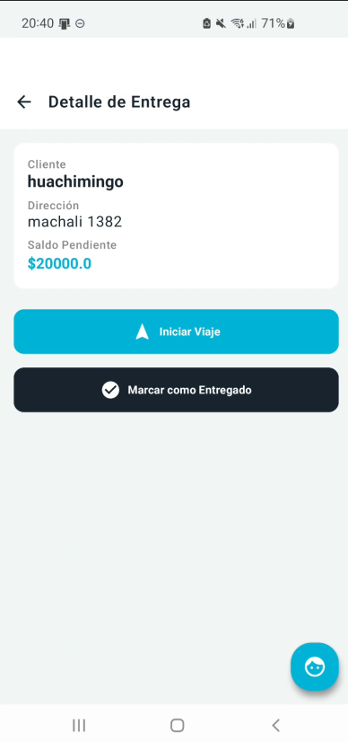
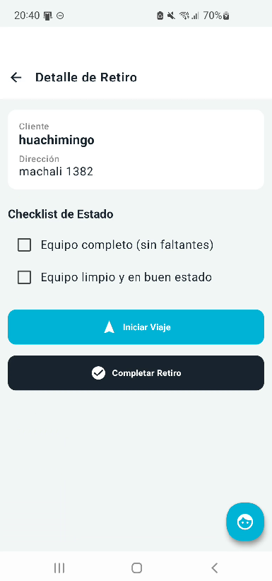

# ArriendApp 🚚
> **Logística & Arriendo Recreativo Premium**

ArriendApp es una aplicación nativa para Android diseñada para la gestión profesional, eficiente y rápida de servicios de arriendo de equipos y logística. 

A través de una interfaz moderna y fluida, los administradores pueden mantener el control absoluto sobre su catálogo de productos, gestionar reservas en tiempo real y comunicarse directamente con los clientes.

---

## 🚀 Características Principales

- **Gestión de Catálogo (CRUD):** Añade, modifica y elimina equipos de tu inventario en tiempo real con sincronización a la nube.
- **Panel de Reservas (Calendario):** Visualiza un listado cronológico con los estados de las reservas (Pendiente, Entregado, Finalizado).
- **Control de Fechas y Precios:** Selección intuitiva de fechas y horas para cada entrega, con formatos de moneda locales (CLP).
- **Comunicación Integrada:** Acceso rápido con un solo toque para llamar al cliente o abrir un chat directo en WhatsApp (sin necesidad de agregarlo a contactos).
- **UI/UX Premium:** Interfaz oscura/clara moderna desarrollada enteramente con Jetpack Compose, animaciones fluidas y un diseño centrado en la eficiencia operativa.

---

## 🛠️ Stack Tecnológico

- **Lenguaje:** Kotlin
- **UI Toolkit:** Jetpack Compose & Material Design 3
- **Arquitectura:** MVVM (Model-View-ViewModel)
- **Backend (BaaS):** Firebase (Authentication & Firestore)
- **Asíncronos:** Kotlin Coroutines & Flows
- **Integraciones Nativas:** Intents (ACTION_DIAL, ACTION_VIEW para WhatsApp)

---

## 📱 Galería de la Aplicación

A continuación, algunas pantallas de la interfaz de usuario de ArriendApp:

  
  
  

  
  
  

  
  
  

---

## 🔒 Nota sobre el Proyecto

Este repositorio funciona como un portafolio y exhibición de la arquitectura, diseño UI/UX y capacidades técnicas del proyecto **ArriendApp**. 

Al ser una aplicación comercial privada, el código fuente completo, las credenciales de Firebase (`google-services.json`) y otros accesos al backend se mantienen restringidos.

---
*Desarrollado para optimizar la logística y el arriendo de equipos a nivel profesional.*
